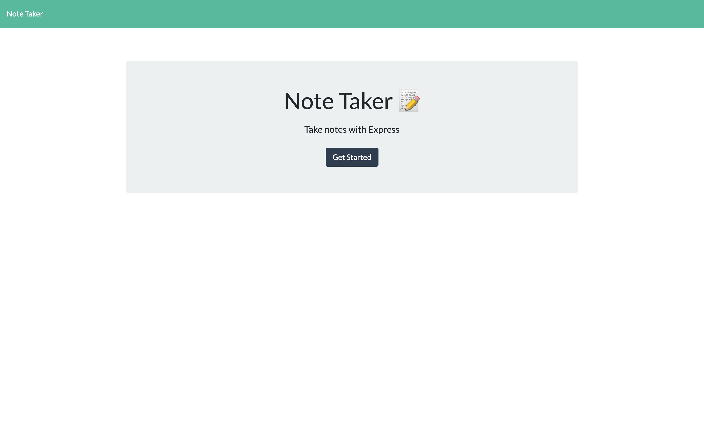
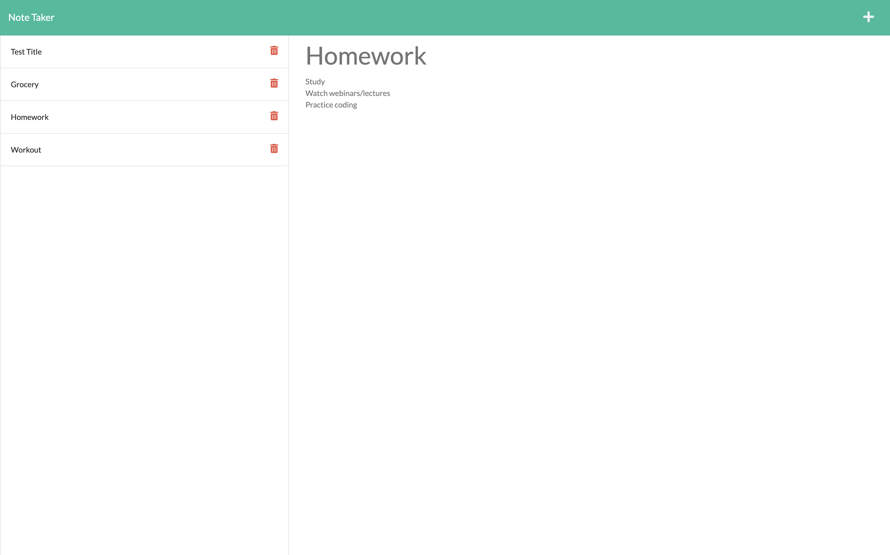

# Note Taker Application
----

----
Need help organizing your daily schedule? This convinenet note taker application can assist you with planning to do tasks.

To use the Note Taker, you will enter the title of your task, then enter in the text associated with the title (or duty) in order to save it. To save, you must have both values filled out, and his the floppy disc icon in the top right. To add more tasks, simply hit the plus sign.

You can access previous tasks and content entered along the left column by simply clicking on them. To go back to the homepage, you can click on the Note Taker logo at the to pleft of the navigation bar. 
----

## Languages Used:
* HTML
* CSS
* JAVASCRIPT
* EXPRESS
* DATABASES

----
----
* [GitHub Repository](https://github.com/jadehuynh/note-taker)
* [Heroku Link](https://boiling-lowlands-79306.herokuapp.com/)
----
----
## Homepage of Note Taker Application

----
## Example of a list of tasks saved
